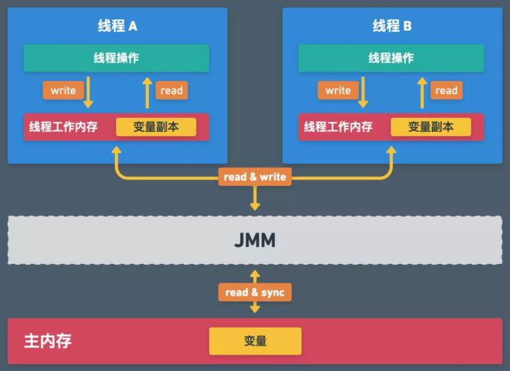

# 线程安全

---


## Java 内存模型

### 多线程风险

在 Java 程序中，存储数据的内存空间分为共享内存和本地内存。线程在读写主存的共享变量时，会先将该变量拷贝一份副本到自己的本地内存，然后在自己的本地内存中对该变量进行操作，完成操作之后再将结果同步至主内存。

类型|存储介质|数据|特征
-|-|-|-
共享内存|主内存|存放变量|多线程共享
本地内存|CPU 高速缓存、缓冲区、寄存器以及其它硬件优化|临时存放线程使用的变量副本|使用期间其它线程无法访问

- 优势：由于 CPU 执行速度明先快于内存读写速度，将运算需要的数据拷贝到 CPU 高速缓存中运算，可以大大加快程序运行速度。
- 劣势：主内存数据和本地内存的不同步，导致多个线程同时操作主内存里的同一个变量时，变量数据可能会遭到破坏。

```java
public class ThreadDemo {
    public static void main(String[] args) {
        MyThread t = new MyThread();
        Thread t1 = new Thread(t);
        Thread t2 = new Thread(t);
        t1.start();
        t2.start();
    }
}

class MyThread implements Runnable {
    private int x = 0;                            // 对象中的数据由线程共享
    @Override
    public void run() {
        for (int i = 0; i < 10000; i++) {
            x++;
        }
        System.out.println("final x: " + x);     // 最后输出的数据不一定为 20000
    }
}
```

### 行为规范

JMM 定义了共享内存系统中多线程程序读写操作行为的规范，用来保证共享内存的原子性、可见性、有序性。




#### 原子性

**原子性是指一个操作，要么全部执行并且执行过程不会被打断，要么就都不执行。**

- Java 语言本身只保证了基本类型变量的读取和赋值是原子性操作。
- 简单操作的原子性可以通过 Atomic 原子类实现。
- 通过 synchronized 和 ReenTrantLock 等锁结构可以保证更大范围的原子性。


#### 可见性

**可见性是指当多个线程访问同一个变量时，一个线程修改了这个变量的值，其他线程能够立即看得到修改的值。**

- Java 语言会尽可能保证主内存数据和本地内存同步，但仍可能出现不可见问题。
- 通常用 volatile 关键字来保证可见性。
- 通过 synchronized 和 ReenTrantLock 等锁结构在释放锁之前会将对变量的修改刷新到主存当中，也能够保证可见性。

#### 有序性

**有序性是指程序执行的顺序按照代码的先后顺序执行。**

- Java 内存模型具备先天的有序性。但 Java 允许编译器和处理器对指令进行重排序，可能影响多线程并发执行时的有序性。
- 通过 synchronized 和 ReenTrantLock 等锁结构可以保证有序性。
- volatile 关键字可以禁止 JVM 的指令重排，也可以保证有序性。

## 线程锁

### 互斥锁和自旋锁

- **互斥锁**

阻塞锁。当线程需要获取的锁已经被其他线程占用时，该线程会被直接挂起。直到其他线程释放锁，由操作系统激活线程。

适用于锁使用者保持锁时间比较长的情况，线程挂起后不再消耗 CPU 资源。

- **自旋锁**

非阻塞锁。当线程需要获取的锁已经被其他线程占用时，该线程会不断地消耗 CPU 的时间去试图获取锁。

适用于锁使用者保持锁时间比较短的情况，没有用户态和内核态调度、上下文切换的开销和损耗。

### 悲观锁和乐观锁

- **悲观锁**

每次读写资源时都会给资源上锁，其他线程想获取该资源时会被阻塞，直到其释放锁。

适用于写频繁的应用场景，写资源请求不会被一直驳回。synchronized 和 ReentrantLock 等独占锁都是悲观锁。

- **乐观锁**

读资源时不会给资源上锁，多个线程可以同时读取资源。写资源时会比对数据检查其他线程有没有更新过该资源，如果未更新就写入资源并更新版本号，否则写资源请求被驳回，重新读取并写资源。 

适用于读频繁的应用场景，多线程同时读取能有效提高吞吐量。CAS 算法和版本号机制都是乐观锁，悲观锁的抢占也会利用 CAS 算法。

### 公平锁和非公平锁

- **公平锁**

加入到队列中等待唤醒，先到者先拿到锁。

公平锁不会出现线程饥饿，迟迟无法获取锁的情况。ReentrantLock 可以实现公平锁。

- **非公平锁**

当线程要获取锁时通过两次 CAS 操作去抢锁，如果没抢到加入到队列中等待唤醒。

非公平锁的性能更好。synchronized 是非公平锁，ReentrantLock 默认情况下也是非公平锁。


### 可重入锁

允许一个线程对同一对象多次上锁。由 JVM 记录对象被线程加锁次数，只有当线程释放掉所有锁（加锁次数为0）时，其他线程才获准进入。

synchronized 和 ReentrantLock 等锁结构都是可重入锁。

---

## 底层实现

### volatile 关键字

**修饰成员变量，每次被线程访问时，强迫从主存中读写该成员变量的值。**

volatile 关键字只能保证可见性，不能保证原子性。多个线程同时操作主内存里的同一个变量时，变量数据仍有可能会遭到破坏。

- 线程执行过程中如果 CPU 一直满载运转，就会默认使用本地内存中的值，而没有空闲读取主存同步数据。
- 线程执行过程中一旦 CPU 获得空闲，JVM 也会自动同步主存数据，尽可能保证可见性。

```java
public class ThreadDemo {
    public static void main(String[] args) throws InterruptedException {
        MyThread t = new MyThread();
        t.start();
        try { 
            Thread.sleep(1000); 
        } catch(InterruptedException e) {}
        t.setRun(false);      
    }
}

class MyThread extends Thread {
    // 添加 volatile 关键字，强制同步主存数据。
    // 删除 volatile 关键字，子线程将始终读取本地内存中 true 副本：陷入死循环。
    private volatile boolean run = true;             
    public void setRun(boolean run) { this.run = run; }
    @Override
    public void run() {
        while (this.run == true) {
            int a = 2;
            int b = 3;
            int c = a + b;
            // System.out.print("CPU rest");      打印输出时 CPU 获得空闲，自动同步主存数据。
        }
        System.out.print("end");   
        return;
    }
}
```


### synchronized 关键字

**修饰方法或代码块。被线程访问时由线程抢占锁，直到执行完毕后自动释放锁。其他线程没有获得锁将无法访问上锁内容。保证了指定内容在同一时刻只有一个线程能访问。**

1. 修饰 static 方法实质是给当前类上锁：这个类的所有 synchronized static 方法共享一个锁。
2. 修饰实例方法实质是给对象上锁：这个对象内所有的 synchronized 实例方法共享一个锁。

每一个对象都有且仅有一个与之对应的 monitor 对象。synchronized 关键字修饰方法时会对方法添加标志位，当线程执行到某个方法时，JVM会去检查该方法的访问标志是否被设置，如果设置了线程会先获取这个对象所对应的 monitor 对象，再执行方法体，方法执行完后释放 monitor 。 

同步代码块则是在同步代码块前插入 monitorenter ，在同步代码块结束后插入 monitorexit 。


```java
public class ThreadDemo {
    public static void main(String[] args) {
        ThreadDemo test = new ThreadDemo();
        new Thread(test::m1).start();
        new Thread(test::m2).start();   
    }
    
    public synchronized void m1() {
        System.out.println("1");
        try { 
            Thread.sleep(1000); 
        } catch(InterruptedException e) {}
        System.out.println("2");
    }

    public synchronized void m2() {
        System.out.println("3");
        try { 
            Thread.sleep(500); 
        } catch(InterruptedException e) {}
        System.out.println("4");
    }
}
```

#### 同步对象

创建两个不同的对象就拥有两把不同的锁，不同对象的 synchronized 实例方法互不影响。

```java
public class ThreadDemo {
    public static void main(String[] args) {
        ThreadDemo test1 = new ThreadDemo();
        ThreadDemo test2 = new ThreadDemo();
        new Thread(test1::m1).start();
        new Thread(test2::m2).start(); 
    }
    
    public synchronized void m1() {
        System.out.println("1");
        try { Thread.sleep(1500); } catch(InterruptedException e) {}
        System.out.println("4");
    }

    public synchronized void m2() {
        try { Thread.sleep(500); } catch(InterruptedException e) {}
        System.out.println("2");
        try { Thread.sleep(500); } catch(InterruptedException e) {}
        System.out.println("3");
    }
}
```

#### 同步方法

其他线程无法获取该对象锁，就不能访问该对象的所有 synchronized 实例方法，但仍可以访问其他方法。 synchronized 实例方法中调取的数据仍可能被其他方法修改。

*在实际开发过程中，我们常常对写操作加锁，但对读操作不加锁，提升系统的并发性能。但可能会导致脏读问题。*

```java
public class ThreadDemo {
    public static void main(String[] args) {
        ThreadDemo test = new ThreadDemo();
        new Thread(test::m1).start();
        new Thread(test::m2).start(); 
    }

    boolean data = false;
    
    public synchronized void m1() {
        System.out.println(data);            // false
        try { 
            Thread.sleep(1000); 
        } catch(InterruptedException e) {}
        System.out.println(data);             // true
    }

    public void m2() throws {
        try { 
            Thread.sleep(500); 
        } catch(InterruptedException e) {}
        this.data = true;
    }
}
```

#### 同步代码块

如果我们需要同步的代码只有一小部分，就没有必要对整个方法进行同步操作，我们只需要同步的代码块进行包裹。

修饰代码块，需要指定被上锁的对象或者类。每次线程进入 synchronized 代码块时就会要求当前线程持有该对象锁，如果当前有其他线程正持有该对象锁，那么新到的线程就必须等待，这样也就保证了每次只有一个线程执行操作。我们通常使用 this 对象或者当前类的 class 对象作为锁。

*不要以字符串对象作为锁的对象。字符串常量在常量池里被锁定，可能会导致意想不到的阻塞。*

```java
public class ThreadDemo {
    public static void main(String[] args) {
        ThreadDemo test = new ThreadDemo();
        new Thread(test::m1).start();
        new Thread(test::m2).start();   
    }
  
    public void m1() {
        synchronized(this) {
            System.out.println("1");
            try { 
                Thread.sleep(1000); 
            } catch(InterruptedException e) {}
            System.out.println("2");
        }  
    }

    public synchronized void m2() {
        synchronized(this) {
            System.out.println("3");
            try { 
                Thread.sleep(500); 
            } catch(InterruptedException e) {}
            System.out.println("4");
        }
    }
}
```

线程执行代码出现异常时也会自动释放所有锁，因此在 synchronized 内部处理异常一定要非常小心。如果不想释放锁，使用 try-catch 语句捕获异常。

### 两者的区别

1. volatile 关键字用于修饰变量，synchronized 关键字用于修饰方法以及代码块。

2. volatile 关键字是数据同步的轻量级实现，性能比 synchronized 关键字更好。

3. volatile 关键字被多线程访问不会发生阻塞，synchronized 关键字可能发生阻塞。

4. volatile 关键字能保证数据的可见性，但不能保证数据的原子性。synchronized 关键字两者都能保证。

```java
// 双重锁结构实现单例模式

public class Singleton {  
    private volatile static Singleton singleton;  
    private Singleton (){}  
    public static Singleton getSingleton() {  
        if (singleton == null) {  
            synchronized (Singleton.class) {    
                if (singleton == null) {  
                    singleton = new Singleton();  
                }  
            }  
        }  
        return singleton;  
    }  
}
```

---

## ReentrantLock 锁

实现 Lock 接口，使用时需导入 `import java.util.concurrent.locks.*;`。

实现功能和 synchronized 关键字类似。但 synchronized 关键字是在 JVM 层面实现的，而 ReenTrantLock 是在 JDK 层面实现的。需要手动调用 lock 和 unlock 方法配合 try/finally 语句块来完成。

```java
public class ReentrantLockTest {
    // 创建锁对象
    static Lock lock = new ReentrantLock();

    public static void main(String[] args) throws InterruptedException {
        for(int i = 0; i < 5; i++){
            new Thread(new MyThread()).start();
        }
    }

    static class MyThread implements Runnable {
        @Override
        public void run() {                                   
            try {
                // 加锁，通常在 try 语句里完成
                lock.lock();
                Thread.sleep(500);
                System.out.println(Thread.currentThread().getName() + "excute");
            } catch (InterruptedException e) {}
            finally{
                // 解锁，必须在 finally 语句里完成
                lock.unlock();    
            }                      
            }
        }
    }
}
```

*ReenTrantLock 比 synchronized 增加了一些高级功能，主要有以下三点：*


### 实现等待中断

调用 lockInterruptibly 方法上锁，线程中断标志置为 true 时会抛出 InterruptedException 异常并释放锁。防止线程因为无法获得锁而一直等待，常用来从外部破坏线程死锁。

```java
public class ThreadDemo {
    // 创建锁对象
    static Lock lock = new ReentrantLock();

    public static void main(String[] args) throws InterruptedException {
        Thread t1 = new Thread(new MyThread(),"thread1");
        Thread t2 = new Thread(new MyThread(),"thread2");
        t1.start();
        t2.start();
        Thread.sleep(500);
        // 提前中断线程
        t2.interrupt();                                      
    }

    static class MyThread implements Runnable {
        @Override
        public void run() {
            System.out.println(Thread.currentThread().getName() + "begin");
            try {
                // 加可中断锁
                lock.lockInterruptibly();                    
                Thread.sleep(2000);
            } catch (InterruptedException e) {
                System.out.println(Thread.currentThread().getName() + "out");
            } finally{
                try{
                    lock.unlock();
                } catch(IllegalMonitorStateException e) {}  
                System.out.println(Thread.currentThread().getName() + "end");
            }
        }
    }
}
```

调用 tryLock 方法上锁，可以从线程内部破坏死锁，可以更好地解决死锁问题。

- 传入时间参数设定等待锁的时间，超时没有获得锁则中止。
- 无参则返回锁申请的结果：true表示获取锁成功，false表示获取锁失败。

```java
public class ThreadDemo {
    // 创建锁对象
    static Lock lock = new ReentrantLock();

    public static void main(String[] args) throws InterruptedException {
        Thread t1 = new Thread(new MyThread(),"thread1");
        Thread t2 = new Thread(new MyThread(),"thread2");
        t1.start();
        t2.start();                                  
    }

    static class MyThread implements Runnable {
        @Override
        public void run() {
            System.out.println(Thread.currentThread().getName() + "begin");
            try {
                // 加锁失败直接退出
                if(!lock.tryLock()) {                         
                    System.out.println(Thread.currentThread().getName() + "out");
                    return;
                }                  
                Thread.sleep(2000);
            } catch (InterruptedException e) {
                e.printStackTrace();
            } finally{
                try{
                    lock.unlock();
                } catch(IllegalMonitorStateException e) {}
                System.out.println(Thread.currentThread().getName() + "end");
            }
        }
    }
}
```

### 实现公平锁

允许先等待的线程先获取锁，防止线程因无法获得锁而一直等待。但由于性能优势，默认情况下仍使用非公平锁。在构造锁对象时添加参数 true 即可实现。

```java
import java.util.concurrent.locks.*;

public class ReentrantLockTest {
    // 创建锁对象，且声明为公平锁
    static Lock lock = new ReentrantLock(true);

    public static void main(String[] args) throws InterruptedException {
        for(int i = 0; i < 5; i++){
            new Thread(new MyThread()).start();
        }
    }

    static class MyThread implements Runnable {
        @Override
        public void run() {
            lock.lock();                                     
            try {
                Thread.sleep(500);
                System.out.println(Thread.currentThread().getName() + "excute");
            } catch (InterruptedException e) {}
            lock.unlock();                                 
            }
        }
    }
}
```

### 选择性通知

ReentrantLock 对象可以创建一个或多个 Condition 对象，实现线程间的等待通知机制。比 synchronized 关键字 使用 wait/notify 方法更为简便和易用。

线程获得 Lock 锁之后便可调用 Condition 接口的 await 方法释放锁并等待,直到有其他线程调用 Condition 的 signal 方法唤醒线程。通过设置多个 condition 对象，多个线程等待不同的 condition 对象，可以实现选择性地叫醒线程。

```java
public class ThreadDemo {

    static ReentrantLock lock = new ReentrantLock();
    static Condition condition = lock.newCondition();

    public static void main(String[] args) throws InterruptedException {
        lock.lock();
        new Thread(new MyThread()).start();
        System.out.println("主线程等待通知");
        try {
            condition.await();
        } finally {
            lock.unlock();
        }
        System.out.println("主线程恢复运行");
    }

    static class MyThread implements Runnable {
        @Override
        public void run() {
            lock.lock();
            try {
                condition.signal();
                System.out.println("子线程通知");
            } finally {
                lock.unlock();
            }
        }
    }
}
```
---

## Atomic 原子类

原子对象的单个方法具有原子性，通过 CAS 算法和自旋操作实现，并发效率高。使用时需导入 `import java.util.concurrent.atomic.*`。

```java
public class ThreadDemo {

    public static void main(String[] args) {
        MyThread t = new MyThread();
        Thread t1 = new Thread(t);
        Thread t2 = new Thread(t);
        t1.start();
        t2.start();
    }
}

class MyThread implements Runnable {
    AtomicInteger count = new AtomicInteger(0);       // 定义整型地原子类
    @Override
    public void run() {
        for (int i = 0; i < 10000; i++) {
            count.incrementAndGet();                  // 原子性自增操作
        }
        System.out.println("final x: " + count);      // 最后输出的数据为 20000
    }
}
```

---

## ThreadLocal 线程本地对象

ThreadLocal 类会对每一个线程创建一个副本，用来保存其私有的数据，其他线程无法访问。简单方便且并发性好，在开发框架中被大量使用，比如 session 管理。

**ThreadLocal 方法**

```java
ThreadLocal threadLocal = new ThreadLocal();        // 构造 ThreadLocal
ThreadLocal<T> threadLocal = new ThreadLocal<>();   // 支持泛型

threadLocal.get();                      // 获取当前线程中保存的变量副本
threadLocal.set(10);                    // 设置当前线程中变量的副本
threadLocal.remove();                   // 移除当前线程中变量的副本
```

**ThreadLocal 示例**

```java
// 两个线程从同一个 MyThread 对象取值，但结果不同。
public class ThreadLocalExample {
    public static void main(String[] args) {
        MyThread t = new MyThread();
        Thread thread1 = new Thread(t);
        Thread thread2 = new Thread(t);
        thread1.start();
        thread2.start();
    }
​}

class MyThread implements Runnable {

    private ThreadLocal threadLocal = new ThreadLocal();

    @Override
    public void run() {
        threadLocal.set((int) (Math.random() * 100D));
        try {
            Thread.sleep(2000);
        } catch (InterruptedException e) {}
        System.out.println(threadLocal.get());
    }
}
```


## AbstractQueuedSynchronizer 类

又名 AQS 框架，位于 java.util.concurrent.locks 包内。用来构建锁和同步器的框架，使用 AQS 能简单且高效地构造出应用广泛的大量的同步器，比如我们提到的 ReentrantLock，Semaphore 等。

AQS 核心思想是通过以下方式，建立一套线程阻塞等待以及被唤醒时锁分配的机制。

- 如果被请求的共享资源空闲，则将当前请求资源的线程设置为有效的工作线程，并且将共享资源设置为锁定状态。
- 如果被请求的共享资源被占用，就将暂时获取不到锁的线程封装成一个结点，加入到一个虚拟的双向队列 CLH 中。

*CLH 不存在真实的队列，仅存在结点之间的关联关系。*


### AQS 存储状态 

AQS 负责维护：

1. 一个 volatile int 成员变量 state
2. 一个 FIFO 线程等待队列

成员变量 state 表示资源状态，通过 getState/setState 方法存取。

线程抢占资源时会通过 CAS 操作去尝试修改 state ，成功则获取锁成功，失败则进入等待队列等待被唤醒。

###  资源共享方式

AQS 定义两种资源共享方式

- **Exclusive（独占）**

只有一个线程能执行，如 ReentrantLock。

state初始化为0，表示未锁定状态。加一后锁定。

- **Share（共享）**

多个线程可同时执行，如 Semaphore/CountDownLatch。Semaphore、CountDownLatCh、 CyclicBarrier、ReadWriteLock 。

返回 state 负数表示失败；0表示成功，但没有剩余可用资源；正数表示成功，且有剩余资源。

### 自定义同步器

同步器的设计是基于模板方法模式的，如果需要自定义同步器一般的方式是这样（模板方法模式很经典的一个应用）：

同步类在实现时一般都将自定义同步器（sync）定义为内部类，供自己使用；而同步类自己（Mutex）则实现某个接口，对外服务。

使用者继承 AbstractQueuedSynchronizer 并重写指定的方法。（这些重写方法很简单，无非是对于共享资源 state 的获取和释放）
将 AQS 组合在自定义同步组件的实现中，并调用其模板方法，而这些模板方法会调用使用者重写的方法。

isHeldExclusively()：该线程是否正在独占资源。只有用到condition才需要去实现它。
tryAcquire(int)：独占方式。尝试获取资源，成功则返回true，失败则返回false。
tryRelease(int)：独占方式。尝试释放资源，成功则返回true，失败则返回false。
tryAcquireShared(int)：共享方式。尝试获取资源。负数表示失败；0表示成功，但没有剩余可用资源；正数表示成功，且有剩余资源。
tryReleaseShared(int)：共享方式。尝试释放资源，如果释放后允许唤醒后续等待结点返回true，否则返回false。

```java
class Mutex implements Lock, java.io.Serializable {
    // 自定义同步器
    private static class Sync extends AbstractQueuedSynchronizer {
        // 判断是否锁定状态
        protected boolean isHeldExclusively() {
            return getState() == 1;
        }

        // 尝试获取资源，立即返回。成功则返回true，否则false。
        public boolean tryAcquire(int acquires) {
            assert acquires == 1; // 这里限定只能为1个量
            if (compareAndSetState(0, 1)) {//state为0才设置为1，不可重入！
                setExclusiveOwnerThread(Thread.currentThread());//设置为当前线程独占资源
                return true;
            }
            return false;
        }

        // 尝试释放资源，立即返回。成功则为true，否则false。
        protected boolean tryRelease(int releases) {
            assert releases == 1; // 限定为1个量
            if (getState() == 0)//既然来释放，那肯定就是已占有状态了。只是为了保险，多层判断！
                throw new IllegalMonitorStateException();
            setExclusiveOwnerThread(null);
            setState(0);//释放资源，放弃占有状态
            return true;
        }
    }

    // 真正同步类的实现都依赖继承于AQS的自定义同步器！
    private final Sync sync = new Sync();

    //lock<-->acquire。两者语义一样：获取资源，即便等待，直到成功才返回。
    public void lock() {
        sync.acquire(1);
    }

    //tryLock<-->tryAcquire。两者语义一样：尝试获取资源，要求立即返回。成功则为true，失败则为false。
    public boolean tryLock() {
        return sync.tryAcquire(1);
    }

    //unlock<-->release。两者语文一样：释放资源。
    public void unlock() {
        sync.release(1);
    }

    //锁是否占有状态
    public boolean isLocked() {
        return sync.isHeldExclusively();
    }
}
```

---

## ReentrantReadWriteLock 锁

Java 的并发包提供了读写锁 ReentrantReadWriteLock ，其拥有两个锁：读锁-共享锁；写锁-排他锁。如果其他线程没有持有写锁，线程就能获得读锁。而只有其他线程没有持有任何锁，线程才能获得写锁。这样在没有写操作的时候，允许多个线程同时读一个资源，提高并发效率。

一个线程要想同时持有写锁和读锁，必须先获取写锁再获取读锁；写锁可以降级为读锁；读锁不能升级为写锁。


## Semaphore 信号量

Semaphore 类是一个同步工具类，需要进行导入：`import java.util.concurrent.Semaphore`。

synchronized 和 ReentrantLock 一次只允许一个线程访问某个资源，如果指定多个线程同时访问某个资源需要钱使用 Semaphore 类。线程执行时调用 acquire 方法申请信号量，如果剩余信号量不足则必须等待其他线程执行完毕后调用 release 方法释放信号量。

**Semaphore 方法**

```java
Semaphore semaphore = new Semaphore(0);       
Semaphore semaphore = new Semaphore(20, true);  

// Semaphore 构造方法设定了初始信号量，可以为 0。默认为非公平锁，设定属性 true 则为公平锁。

semaphore.acquire();              // 线程获取一个信号量
semaphore.acquire(5);             // 线程获取五个信号量

semaphore.release();              // 线程释放一个信号量
semaphore.release(5);             // 线程释放五个信号量

semaphore.availablePermits();     // 读取剩余信号量
```

**Semaphore 示例**

```java
public class SemaphoreExample1 {

  public static void main(String[] args) throws InterruptedException {
    ExecutorService threadPool = Executors.newFixedThreadPool(300);
    // 设置 20 个信号量
    final Semaphore semaphore = new Semaphore(20);
    // final Semaphore semaphore = new Semaphore(20, true);  公平锁

    for (int i = 0; i < 500; i++) {
      final int threadnum = i;
      threadPool.execute(() -> {
        try {
          semaphore.acquire();             // 获取一个信号量
          test(threadnum);
          semaphore.release();             // 释放一个信号量
        } catch (InterruptedException e) {
          e.printStackTrace();
        }

      });
    }
    threadPool.shutdown();
    System.out.println("finish");
  }

  public static void test(int threadnum) throws InterruptedException {
    Thread.sleep(1000);
    System.out.println("threadnum:" + threadnum);
    Thread.sleep(1000);
  }
}
```

---

## CountDownLatch 倒计时器

CountDownLatch 类是一个同步工具类，需要进行导入：`import java.util.concurrent.CountDownLatch`。

其通过 await 方法设置一个屏障，线程到达后被阻塞。直到其他线程调用 countDown 方法达到 N 次后才允许向后执行。 CountDownLatch 类是一次性的，计数器值只能在构造方法中初始化一次，不能被重复使用。常用来协同多个线程之间的执行顺序，比如主线程需要等待多个组件加载完毕之后再继续执行。

**CountDownLatch 方法**

```java
CountDownLatch latch = new CountDownLatch(5);

// CountDownLatch 构造方法设定了门闩个数。

latch.countDown();                // 解锁门闩，门闩个数减一
latch.await();                    // 线程等待门闩，个数为 0 后向后执行
```

**CountDownLatch 示例**

```java
import java.util.concurrent.CountDownLatch;

public class ThreadDemo {

    final static CountDownLatch latch = new CountDownLatch(5);

    public static void main(String[] args) throws InterruptedException {
        for(int i = 0; i < 5; i++) {
            new MyThread().start();
        }
        latch.await();
        System.out.println("主线程继续执行");
    }

    static class MyThread extends Thread {
        @Override
        public void run() {
            try {
                System.out.println(getName() + "打开门闩");
            } finally {
                latch.countDown();
            }
        }
    }
}
```

---

## CyclicBarrier 循环栅栏

CyclicBarrier 类也是一个同步工具类，需要进行导入：`import java.util.concurrent.CyclicBarrier`。

其通过 await 方法设置一个屏障，线程到达后被阻塞。只有当 N 个线程都到达屏障后才允许这些线程向后执行。和 CountDownLatch 不同，CyclicBarrier 可循环利用。常用于多线程计算数据，最后合并计算结果的场景。

**CyclicBarrier 方法**

```java
CyclicBarrier barrier = CyclicBarrier(10); 
CyclicBarrier barrier = CyclicBarrier(10, ()-> System.out.println("open"));

// CyclicBarrier 构造方法设定了参与线程的个数 N，也可以选择设定在第 N 个线程到达屏障时执行方法。

barrier.await();                             // 线程必须等到 N 个线程才能向后执行
barrier.await(20, TimeUnit.SECONDS);         // 线程等待规定时间后无论如何都会向后执行
```

**CyclicBarrier 示例**

```java
import java.util.concurrent.CyclicBarrier;

public class CyclicBarrierDemo {  
    public static void main(String[] args) {  
        for(int i = 0; i < 10; i++) {
            new MyThread().start();
        }
    } 
}

class MyThread extends Thread {
    static CyclicBarrier barrier = new CyclicBarrier(5, new Runnable() {
        @Override
        public void run() {
            System.out.println("栅栏开启");
        }
    });
        
    @Override
    public void run() {
        try {
            Thread.sleep(1000);
            System.out.println(getName() + " 到达栅栏");
            barrier.await();
            System.out.println(getName() + " 冲破栅栏");
        } catch (Exception e) {
            e.printStackTrace();
        }
    }
}
```

